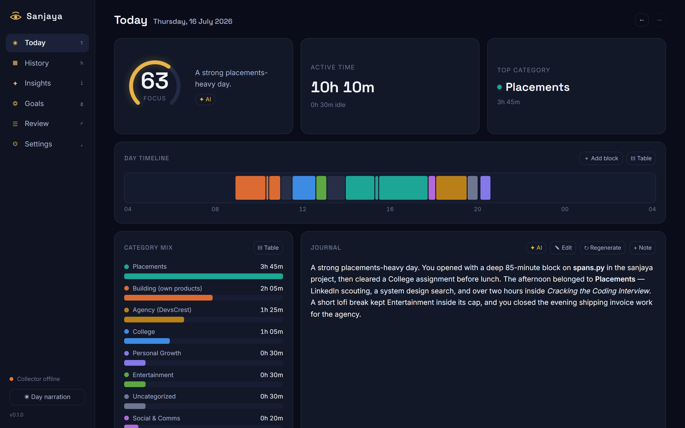
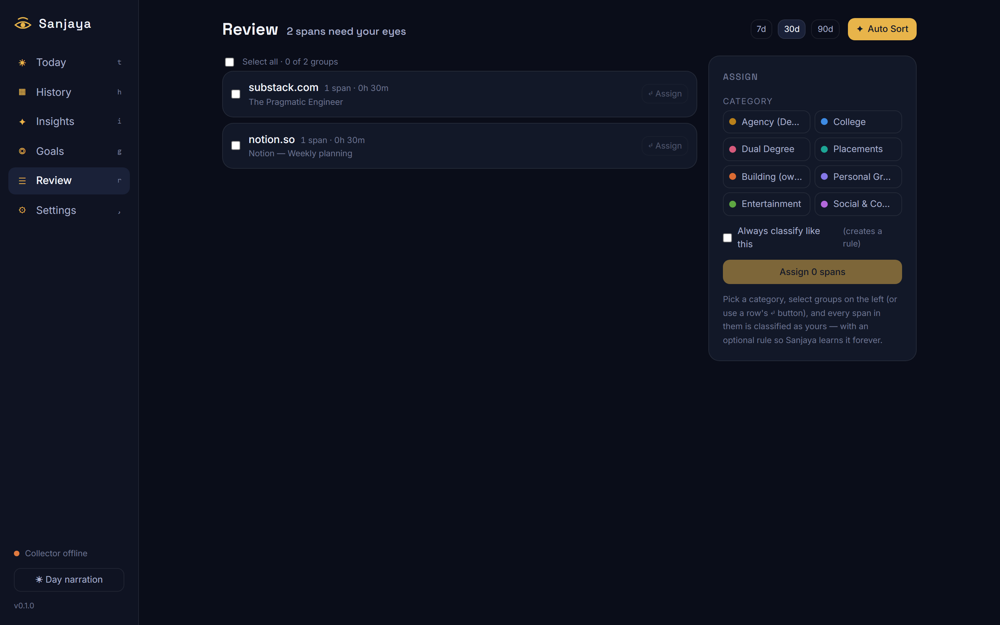
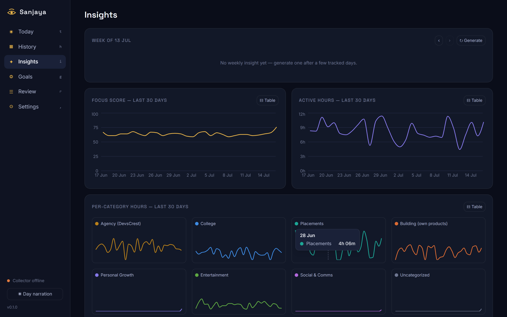

<div align="center">

# 👁️ Sanjaya

### *Your day, witnessed. Your journal, written.*

An AI-powered, **zero-effort** activity journal for Windows. Sanjaya quietly watches
where your time actually goes, then turns the raw stream into categorized time, a
written daily journal, highlights, and goal progress — all on a local dashboard.

**Everything stays on your machine** except the short text summaries sent to Groq to
write the journal.


<br/>



</div>

---

## Why Sanjaya

Most time trackers make *you* do the work — start timers, tag tasks, remember what you
did. Sanjaya inverts that: it watches honestly in the background and does the
bookkeeping for you. You just read the story of your day.

| | |
|---|---|
| 🪶 **Featherweight** | A tiny background watcher. Budget: **< 0.5% CPU, < 150 MB RAM**. |
| 🔒 **Local-first** | Raw activity never leaves your PC — only redacted text summaries reach Groq. |
| ✍️ **Writes itself** | A nightly (or on-demand) AI journal: where your time went, what you got done. |
| 🎯 **Goals & streaks** | "≥ 3h Placements daily" with 🔥 streaks, rest days, and caps. |
| 🧠 **Learns from you** | Correct any span once; Sanjaya turns it into a rule and never asks again. |
| ✦ **AI Auto Sort** | One click classifies your whole review queue — confident picks assigned, rest left for you. |
| 🖥️ **Feels native** | Tray icon + a chromeless desktop dashboard window (installable as an app). |

---

## Screens

<div align="center">

**Review — with ✦ AI Auto Sort**



**Insights — weekly trends**



</div>

---

## Quick start

> **New here?** The plain-language, start-to-finish install guide is
> **[`docs/INSTALL.md`](docs/INSTALL.md)** (about 10 minutes, no coding needed).

**Requirements:** Windows 10/11 · Python 3.12+ · [`uv`](https://docs.astral.sh/uv/) ·
Microsoft Edge or Google Chrome.

```powershell
uv sync                              # create venv + install deps
copy .env.example .env               # then paste your GROQ_API_KEY
uv run python -m sanjaya --init-db   # create data/sanjaya.db
uv run python -m sanjaya             # start the watcher + tray
```

A gold **eye** appears in the tray (click the `^` overflow arrow if hidden).
Right-click it → **Open Dashboard**.

**Make it a real desktop app** — a Desktop/Start-Menu icon that launches silently
(no console):

```powershell
powershell -ExecutionPolicy Bypass -File scripts\install_shortcut.ps1
```

Dev helper: `./scripts/dev.ps1 <setup|run|version|initdb|test|lint>`.

---

## How it works

Sanjaya runs as **one process** with three parts:

1. **The watcher (collector)** — samples the foreground window every couple of seconds,
   folds noise into clean *spans*, and respects idle / lock / pause.
2. **The tray icon** — your remote: Open Dashboard · Pause · Summarize now ·
   Start with Windows · Quit.
3. **The dashboard** — a local SPA served at `http://127.0.0.1:8756`, shown in a
   chromeless Edge/Chrome **`--app` window** so it looks and behaves like a native app.
   (Set `[server] app_window = false` in `config.toml` for a normal tab.)

Deterministic **rules** categorize what they can instantly; anything unknown is batched
to a Groq LLM. The dashboard's numbers are always real even when AI is offline — work
just queues in `ai_queue` and drains when you reconnect.

---

## Browser extension (recommended)

Window titles alone are low-fidelity. The MV3 extension in
[`extension/`](extension/README.md) adds **exact URLs, search queries, and YouTube
title + channel** — so a coding tutorial is filed as learning, not lumped under
"YouTube". It posts **only** to `127.0.0.1`.

Set the same `SANJAYA_INGEST_TOKEN` in `extension/background.js` as in your `.env`, then
`chrome://extensions` → **Developer mode** → **Load unpacked** → pick `extension/`.

---

## Review & AI Auto Sort

The **Review** page collects only what needs a human eye — uncategorized and
low-confidence spans, grouped by identity (and **per video** for YouTube, judged by its
title). Then:

- **✦ Auto Sort** — one Groq call classifies every group. Confident picks (≥ 0.8) are
  assigned and turned into learned rules; unsure ones stay for you. It judges by
  *content*, so an educational video → a learning category, not Entertainment, and a
  browser is never blanket-labeled.
- **↺ Undo** — reverse the last Auto Sort run (assignments **and** rules) in one click.
- Sanjaya's own dashboard is auto-excluded from Review every time (real sites and PDFs
  are not).

---

## AI (Groq)

Set `GROQ_API_KEY` in `.env`. Unknown spans classify in batches
(`llama-3.1-8b-instant`); the daily journal is written nightly at 21:30
(`llama-3.3-70b-versatile`, configurable) and on demand from the tray or
`POST /api/summary/{date}/generate`. A daily **token cap** and exponential-backoff
retries keep it cheap and resilient; `debug_ai_payloads = true` dumps every outbound
payload to `data/ai_payloads/` for auditing.

---

## Data & privacy

All raw data lives in `data/sanjaya.db`, on your machine only. Only compressed,
redaction-filtered text summaries are sent to Groq. Excluded apps/sites are timed
honestly but scrubbed to `[excluded]` **before** the first write and never sent to AI.
`data/`, `.env`, and `config.toml` are gitignored.

---

## Tech & footprint

React 18 + TypeScript + Vite + Tailwind v4 + Recharts on the front; FastAPI + SQLite +
APScheduler + a Groq (OpenAI-compatible) client on the back. Direct dependencies are
capped at ~15 — each justified below.

<details>
<summary><b>Dependency justifications</b></summary>

| Dependency | Why |
|---|---|
| `psutil` | pid→exe resolution, process info, self CPU/RAM metrics |
| `fastapi` | localhost JSON API + static SPA host |
| `uvicorn` | ASGI server for FastAPI |
| `apscheduler` | nightly summary / rollup / ai_queue drain jobs |
| `openai` | Groq API client (OpenAI-compatible `base_url`) |
| `python-dotenv` | load `GROQ_API_KEY` / `SANJAYA_INGEST_TOKEN` from `.env` |
| `tzdata` | IANA timezone db for `zoneinfo` on Windows |
| `pystray` | featherweight tray icon + menu |
| `Pillow` | render the tray/app icon image |
| `pywin32` | foreground window, idle time, session lock events |
| `winsdk` | media-session metadata (video/song titles incl. YouTube) |
| `uiautomation` | stopwatch reader for Windows Clock (best-effort, P1) |

`sqlite3`, `tomllib`, `zoneinfo`, `logging` are stdlib. Windows-only packages carry
`sys_platform == 'win32'` markers so the pure-logic test suite runs on any OS.

</details>

---

## Dashboard dev

```powershell
cd dashboard
npm install
npm run dev     # Vite on 5173, /api proxied to 127.0.0.1:8756
npm run build   # tsc + vite build -> ../sanjaya/server/static
```

Visual QA without real data:
`uv run python scripts/preview_server.py` (port 8899, seeded demo DB in a temp dir —
never touches `data/sanjaya.db`). The screenshots above were captured from it.

<details>
<summary><b>Build history (Phases 0–10)</b></summary>

- **Phase 0 — Scaffold** ✅ repo layout, DB schema + seeds, config, logging, CLI.
- **Phase 1 — Collector core** ✅ sampler, idle/lock, span builder, tray, single instance.
- **Phase 2 — Parsers + rules + focus** ✅ deterministic parsers, rule engine, focus score.
- **Phase 3 — Server + ingest + extension** ✅ FastAPI on 8756, `/api/status`,
  token-authed `/ingest/browser`, MV3 extension, span reconciliation.
- **Phase 4 — AI layer** ✅ Groq client (retries/backoff/Retry-After, JSON mode,
  redaction, token budget, payload debug dump), classifier job, ai_queue drain.
- **Phase 5 — Journal + insights** ✅ nightly daily journal, weekly insight, regenerate
  endpoints, deterministic focus score persisted, quiet-day handling.
- **Phase 6 — Dashboard read views** ✅ React/TS/Vite/Tailwind/Recharts SPA served by
  FastAPI. Dark + light themes, categorical palette, Today/History/Insights.
- **Phase 7 — Editability** ✅ every span correctable; "always classify like this" learns
  a rule that retro-applies and hot-reloads the collector. Review queue + bulk assign.
- **Phase 8 — Goals & habits** ✅ daily/weekly/monthly/yearly goals, at-least/at-most,
  streaks with rest days, cached progress healed by a nightly rollup.
- **Phase 9 — Settings, privacy, export, polish** ✅ Settings page, learned-rules table,
  privacy (exclude/redact/retention), AI config + Test-connection, JSON/CSV/Markdown export.
- **Phase 10 — Soak & ship** ✅ self-metrics vs perf budget, first-run onboarding,
  fresh-machine install path.
- **Post-ship — Learning** ✅ AI Auto Sort + Undo, content-aware classification
  (per-video YouTube), self-exclusion, installable PWA + gold-eye icon.

</details>

---

<div align="center">
<sub>Built by <a href="https://www.devscrest.in">Devansh Srivastava</a> · powered by Groq · your time, honestly.</sub>
</div>
